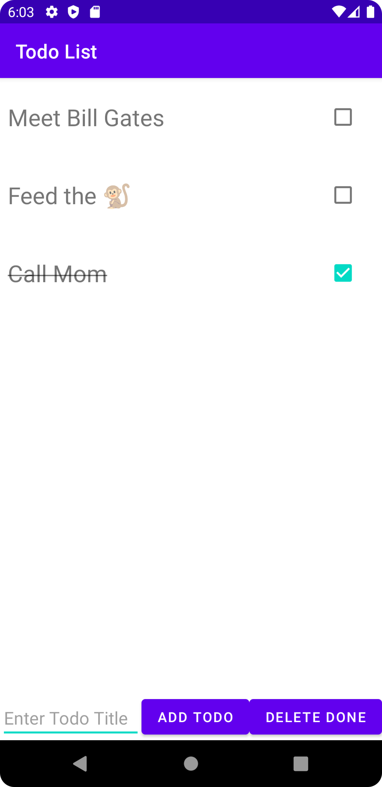

# Todo List

A basic todo list app using Kotlin.

## Features

- setting up Android Studio.
- understanding the project structure.
- building the layout.

Based on [Build A Simple Android App With Kotlin](https://www.youtube.com/watch?v=BBWyXo-3JGQ) by Philipp Lackner for Traversy Media (2021).
