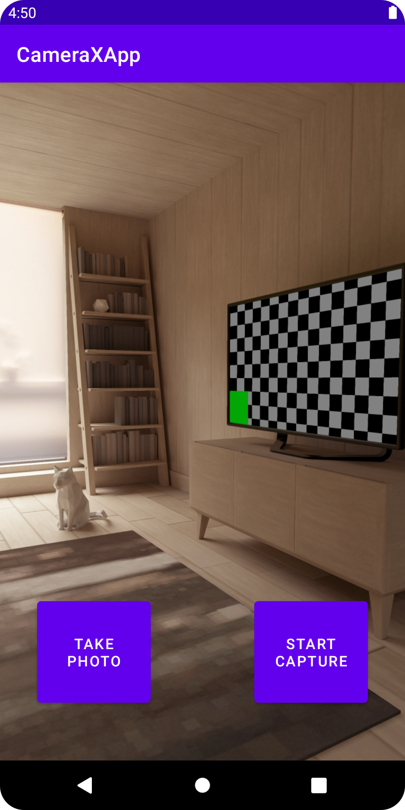

# CameraXApp

A camera app, using CameraX to show a viewfinder and take photos.

<!-- 

 -->

## Features

- adding the CameraX dependencies.
- displaying the camera preview in an activity.
- requesting the necessary permissions.
- taking a photo and saving it to storage.
- analyzing frames from the camera in real time.
- capturing video to MediaStore.

Based on [Getting Started with CameraX](https://developer.android.com/codelabs/camerax-getting-started) by Google Codelabs (2022).
