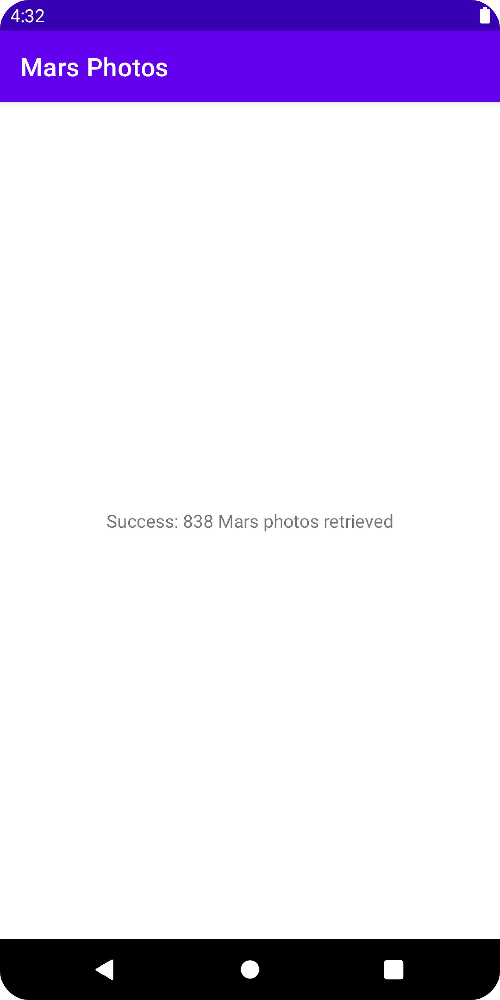

# MarsPhotos

An app to learn how to get data from an API, using Retrofit to make REST requests.

## Features

- modifying a starter app to make a web service API request and handle the response.
- implementing a network layer for the app using the Retrofit library.
- parsing the JSON response into the app's LiveData objects with the Moshi library.
- using Retrofit's support for coroutines to simplify the code.
- using the Glide library to load and display an image from a web URL.
- adding a loading animation and error icon.
- displaying a grid of images with a RecyclerView.
- handling potential errors.
- adding "for sale" images to the overview.
- filtering the results.
- creating a detail page and setting up navigation.

Based on 3 tutorials by Google Codelabs (2022):

- [Get data from the internet](https://developer.android.com/codelabs/basic-android-kotlin-training-getting-data-internet)
- [Loading and displaying images from the internet](https://codelabs.developers.google.com/codelabs/kotlin-android-training-internet-images/index.html?index=..%2F..android-kotlin-fundamentals#0)
- [Filtering and detail views with internet data](https://developer.android.com/codelabs/kotlin-android-training-internet-filtering?index=..%2F..android-kotlin-fundamentals#0)
