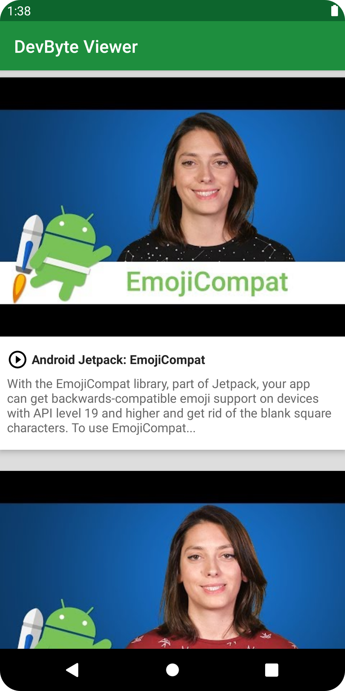

# DevBytes

A list of DevByte videos, using offline caching.

## Features

- implementing a local database using Room.
- fetching data from the network and caching the data in the database.
- using a repository to abstract the data layer.
- integrating the respository class with the ViewModel.
- displaying data from the offline cache.

Based on [Repository](https://developer.android.com/codelabs/kotlin-android-training-repository#0) by Google Codelabs (2022).
