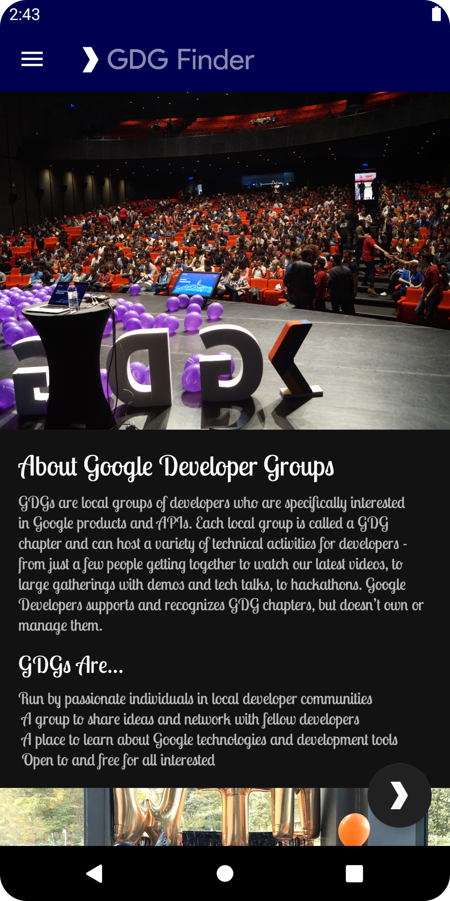

# GDG Finder

An app to learn the basics of Android's styling system.

## Features

- using view attributes for styling.
- using themes and downloadable fonts.
- using styles.
- adding a floating action button.
- changing the toolbar theme.
- extracting and using dimensions.
- creating and using custom Material color schemes with the [Color Tool](https://material.io/tools/color/).
- adding support for right-to-left (RTL) languages.
- scanning for accessibility.
- designing for TalkBack.
- using chips to filter regions.
- supporting night mode.

Based on 3 tutorials by Google Codelabs (2022):

- [Styles and themes](https://codelabs.developers.google.com/codelabs/kotlin-android-training-styles-and-themes/#0)
- [Material Design, dimens, and colors](https://developer.android.com/codelabs/kotlin-android-training-material-design-dimens-colors#0)
- [Design for everyone](https://codelabs.developers.google.com/codelabs/kotlin-android-training-design-for-everyone/#0)
