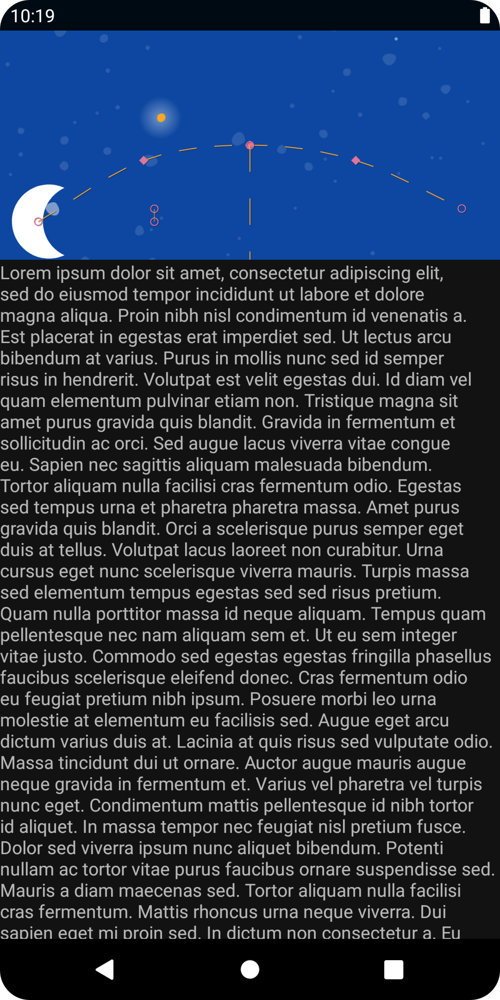

# Milky Way

An app to learn how to finely customize an animation, using MotionLayout.

<!-- 

 -->

## Features

- defining an animation with ConstraintSets and MotionLayout.
- animating based on drag events.
- changing the animation with KeyPosition.
- changing attributes with KeyAttribute.
- running animations with code.
- animating collapsible headers with MotionLayout.

Based on [Advanced Android in Kotlin 03.2: Animation with MotionLayout](https://codelabs.developers.google.com/codelabs/motion-layout#0) by Google Codelabs (2022).
