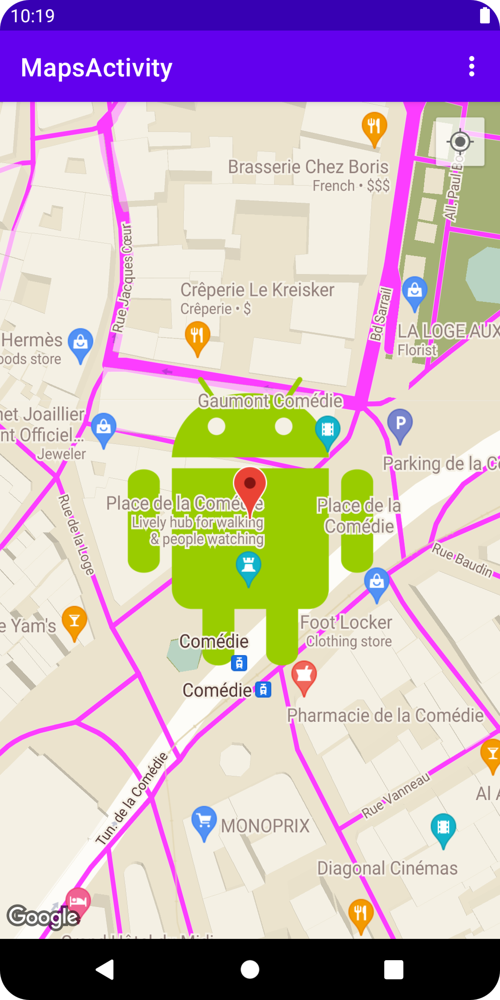

# Wander

A Google Maps app that displays customized maps and the user's location.

## Features

- registering an API key in an Android app.
- integrating a Google Map.
- displaying different map types.
- styling the Google Map.
- adding markers to the map.
- enabling the user to place a marker on a point of interest.
- enabling location tracking.

Based on [Android Google Maps](https://codelabs.developers.google.com/codelabs/advanced-android-kotlin-training-maps) by Google Codelabs (2022).
