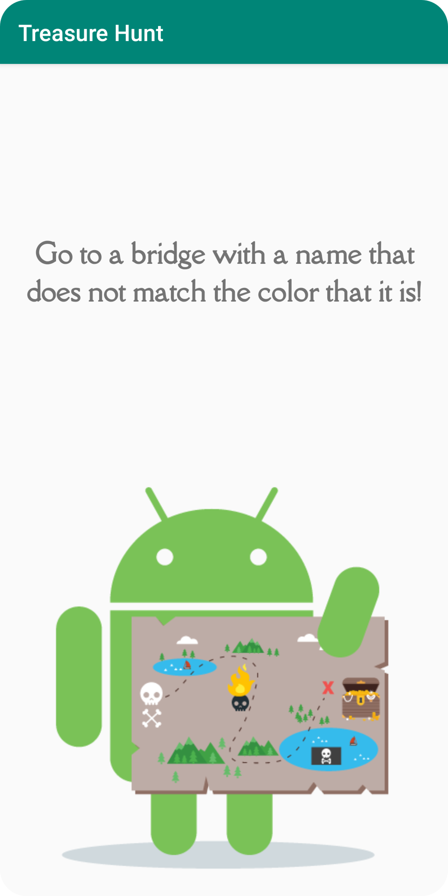

# Treasure Hunt

A real-world scavenger hunt using geofencing.

## Features

- checking user permissions and device settings.
- adding broadcast receivers.
- adding and removing geofences.
- handling geofence transitions.
- mocking locations in the emulator.
- navigating to the winning location.

Based on [Adding Geofencing to Your Map](https://codelabs.developers.google.com/codelabs/advanced-android-kotlin-training-geofencing) by Google Codelabs (2022).
