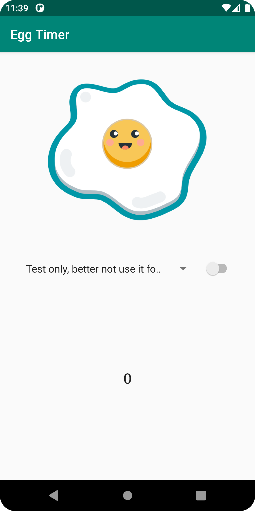

# Egg Timer

A timer app for cooking eggs, using notifications and Firebase Cloud Messaging.

## Features

- adding a notification to the starter app.
- cancelling a notification.
- creating channels for different types of notifications.
- customizing the notifications.
- adding quick actions to make the notification interactive.
- turning off notification badges.
- pushing messages to the user via Firebase Cloud Messaging.
- subscribing to topics.
- sending a data payload.
- handling notifications when the app is in the foreground.

Based on 2 tutorials by Google Codelabs (2022):

- [Using Android Notifications](https://developer.android.com/codelabs/advanced-android-kotlin-training-notifications#0)
- [Android Firebase Cloud Messaging](https://codelabs.developers.google.com/codelabs/advanced-android-kotlin-training-notifications-fcm)
