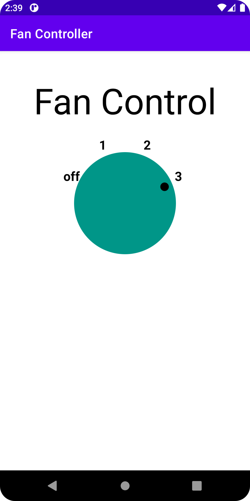

# Fan Controller

A fan control UI to learn how to create a custom view.

## Features

- extending View to create a custom view.
- initializing the custom view with drawing and painting values.
- overriding OnDraw() to draw the view.
- adding the custom view to a layout.
- adding view interactivity with performClick().
- using custom attributes for colors.
- adding accessibility with TalkBack.

Based on [Creating Custom Views](https://developer.android.com/codelabs/advanced-android-kotlin-training-custom-views) by Google Codelabs (2022).
