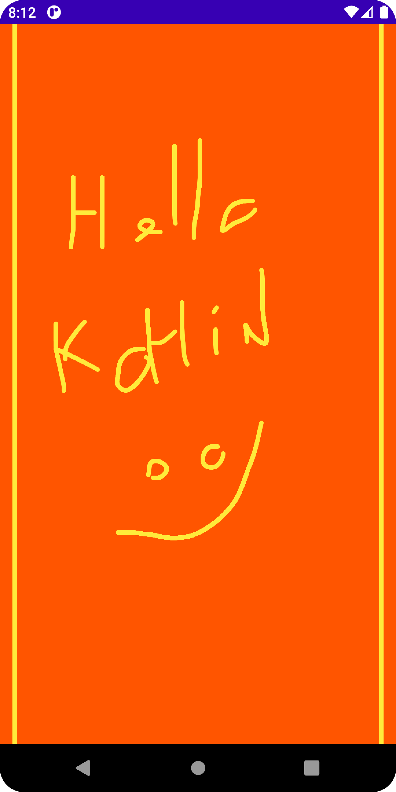

# MiniPaint

A simple line drawing app, using a canvas.

<!-- 

 -->

## Features

- creating a custom view for drawing.
- displaying the canvas.
- setting up a paint and a path for drawing.
- drawing following the user's touch.

Based on [Drawing on Canvas Objects](https://developer.android.com/codelabs/advanced-android-kotlin-training-canvas#0) by Google Codelabs (2022).
