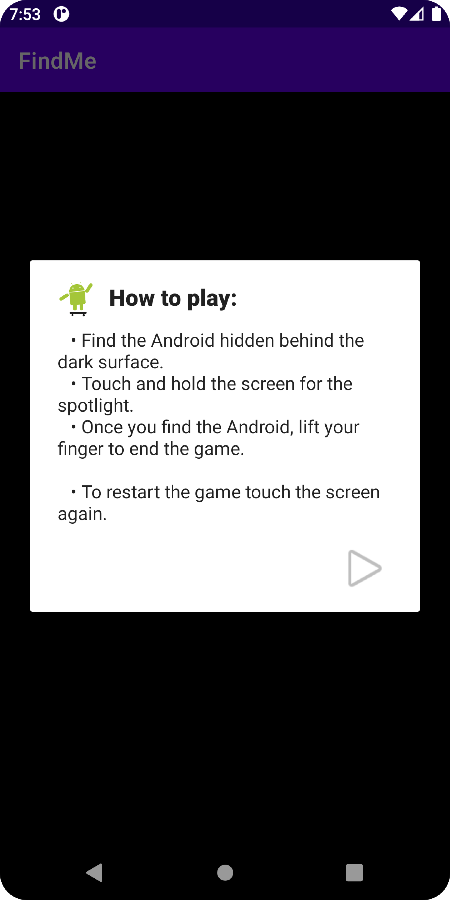

# FindMe

A simple game to learn how to create effects with shaders.

## Features

- creating a custom ImageView.
- understanding the concept of shaders.
- creating the BitmapShader and drawing it.
- calculating a random location for the Android image.
- using the BitmapShader.
- responding to motion events.
- adding an instructions dialog.

Based on [Creating Effects with Shaders](https://developer.android.com/codelabs/advanced-android-kotlin-training-shaders#0) by Google Codelabs (2022).
