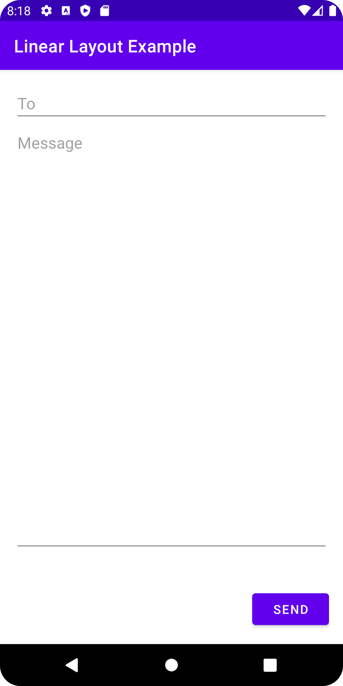

# Linear Layout Example

A basic Android app to learn how to use a linear layout.

## Features

- defining a linear layout.
- using padding, weight and margin.
- controlling the position of a view's content with gravity.
- controlling the position of a view within a layout with layout-gravity.

Based on [Head First Android Development: A Brain-Friendly Guide](https://www.amazon.com/Head-First-Android-Development-Brain-Friendly/dp/1449362184) by David Griffiths and Dawn Griffiths (2021).
