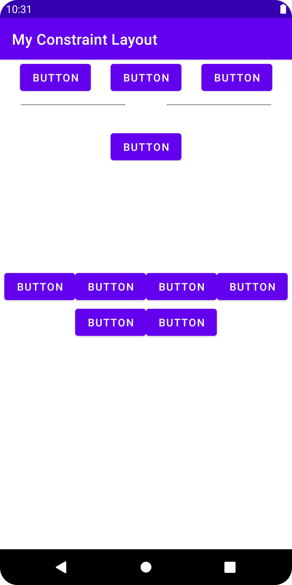

# My Constraint Layout

A basic Android app to learn how to use constraint layouts.

## Features

- positioning and sizing a single view in a constraint layout.
- connecting and aligning views.
- using guidelines and constraints.
- creating a chain to control a linear group of views.
- adding a flow to handle a multi-line chain.

Based on [Head First Android Development: A Brain-Friendly Guide](https://www.amazon.com/Head-First-Android-Development-Brain-Friendly/dp/1449362184) by David Griffiths and Dawn Griffiths (2021).
