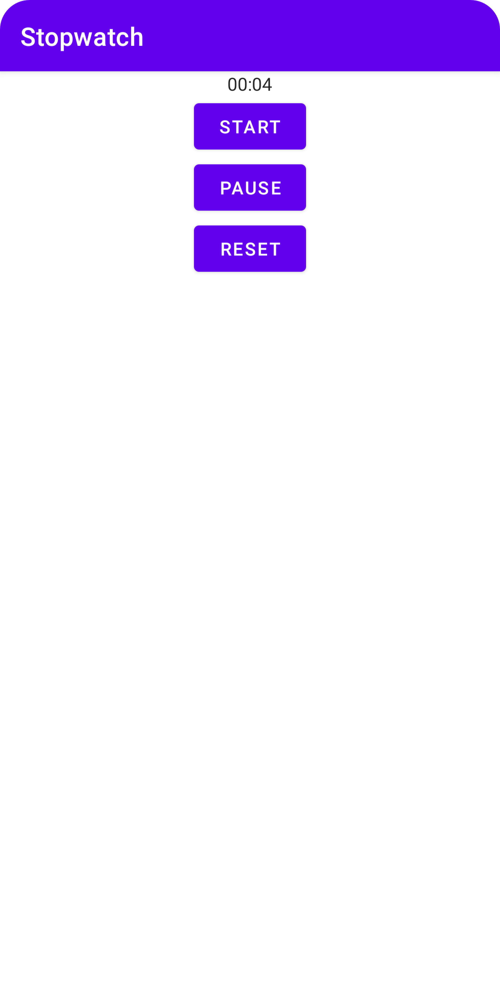

# Stopwatch

A simple timer to learn how to use activity lifecycle.

## Features

- starting, pausing and resetting a Chronometer view.
- saving the current state in a Bundle.
- handling state when an activity becomes invisible.
- handling state when an activity doesn't have the focus.
- refactoring to implement view binding.

Based on [Head First Android Development: A Brain-Friendly Guide](https://www.amazon.com/Head-First-Android-Development-Brain-Friendly/dp/1449362184) by David Griffiths and Dawn Griffiths (2021).
