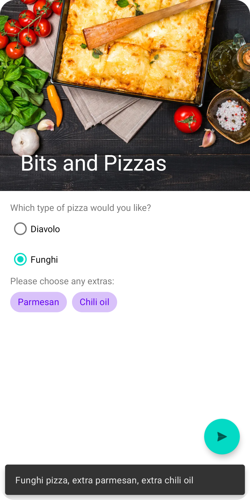

# Bits and Pizzas

A create order screen to discover how to implement Material views.

## Features

- adding a toolbar that can scroll, collapse and expand.
- adding radio buttons, chips, and a floating action button.
- displaying pop-up messages with toasts and snackbars.

Based on [Head First Android Development: A Brain-Friendly Guide](https://www.amazon.com/Head-First-Android-Development-Brain-Friendly/dp/1449362184) by David Griffiths and Dawn Griffiths (2021).
