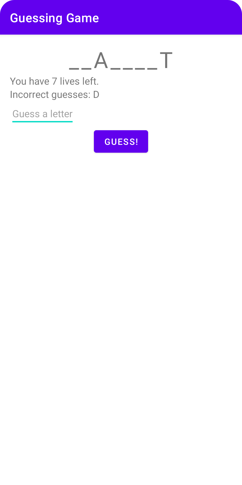

# Guessing Game

A guessing game to discover how to use a view model.

## Features

- writing the game logic.
- navigating between the two fragments.
- holding game logic and data in a view model.
- adding messages to logcat.
- holding the result of the game in a second view model via a factory class.
- using live data.
- restricting direct access to a view model's proerties using backing properties.
- adding a game over property.

Based on [Head First Android Development: A Brain-Friendly Guide](https://www.amazon.com/Head-First-Android-Development-Brain-Friendly/dp/1449362184) by David Griffiths and Dawn Griffiths (2021).
